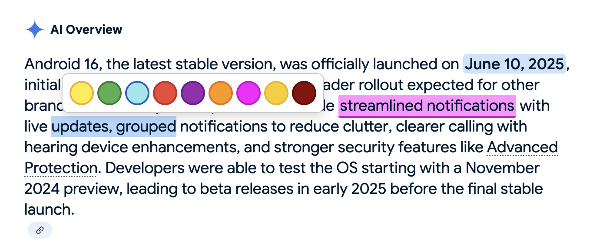

### Chrome Text Marker

Lightweight Chrome extension to quickly highlight any text on the web using a clean color palette and simple keyboard shortcuts. Inspired by the great Text Marker add‑on for Firefox.

---

### About

Select text on any page and either tap a number key to apply a color immediately or use the inline color palette that appears near your selection. Highlights are stored per page using Chrome storage and are restored on reload.

---

### Installation

1. Download or clone this repository.
2. Open Chrome and go to `chrome://extensions`.
3. Enable "Developer mode" (top‑right).
4. Click "Load unpacked" and select this project folder.

Optional: Open the extension details to customize the command shortcuts if you like.

---

### Features

- **Instant highlight with number keys (1–9)**
  - 1: yellow
  - 2: green
  - 3: blue
  - 4: fuschia
  - 5: gold
  - 6: dark red
  - 7: red
  - 8: purple
  - 9: orange
- **Inline color palette**: select text and a small palette pops up so you can click a color.
- **Click to remove**: click any highlight to remove it; you can also select text and press the remove command.
- **Persists on reload**: highlights are saved locally per page (via `chrome.storage.local`).
- **Commands (Chrome shortcuts)**
  - `Ctrl+Shift+Y`: highlight yellow
  - `Ctrl+Shift+G`: highlight green
  - `Ctrl+Shift+B`: highlight blue
  - `Ctrl+Shift+D`: remove highlight at selection

---

### Demo

Tip: select any text on a page and press a number key (1–9) to apply a color instantly.

---

### Future ideas

- Possibility to customize which colors are mapped to shortcuts 1–9
- User‑configurable palette and ordering
- Export/import of highlights per domain

---

### Credits

This project was motivated and inspired by the excellent **Text Marker** extension for Firefox. Since it wasn’t available for Chrome, this repository attempts to replicate a similar, fast workflow for Chrome users.

